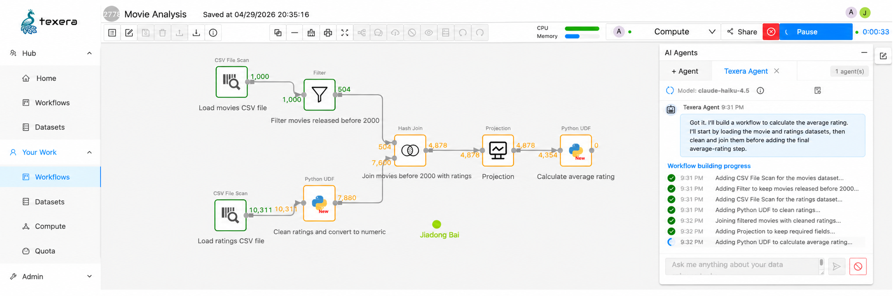

<h1 align="center">Apache Texera - Human-AI Collaborative Data Science Using Visual Workflows</h1>

<p align="center">
  <a href="https://texera.io">  </a>
  <br>
  <i>Apache Texera (Incubating) is an open-source platform for human-AI collaborative data science using visual workflows.</i>
  <br>
  
  <h4 align="center">
    <a href="https://texera.apache.org/">Official Site</a>
    |
    <a href="https://texera.io/category/video/">Video</a>
    |
    <a href="https://texera.io/publications/">Publications</a>
    | 
    <a href="https://texera.io/category/blog/">Blog</a>
    <br>
  </h4>
  
</p>
</p>
<p align="center">
  
  
  
  
  
  
  
  <a href="https://app.codecov.io/gh/apache/texera"></a>
</p>

Apache Texera (Incubating) is an open-source platform for human-AI collaborative data science using visual workflows. It enables human analysts to construct, execute, and refine data analysis tasks through an intuitive GUI, assisted by AI agents that understand natural-language instructions. Texera is well suited for a wide range of applications, including “AI for Science,” by making advanced AI and data science capabilities accessible to a broader community. It can run on a laptop for local use or be deployed in the cloud to support scalable processing of large datasets.

The platform has the following key features:

* Natural-language data science through AI agents 
* Intuitive GUI-based workflows for data science
* Real-time collaboration for workflow editing and execution
* Runtime debugging and interactive workflow execution
* Language-agnostic workflow runtime, native support for Python and Java
* Parallel backend engine for scalable big-data processing
* Separation of compute and storage for flexible cloud deployment





# Citation
Please cite Texera as 
```

@article{DBLP:journals/pvldb/WangHNKALLDL24,
  author       = {Zuozhi Wang and
                  Yicong Huang and
                  Shengquan Ni and
                  Avinash Kumar and
                  Sadeem Alsudais and
                  Xiaozhen Liu and
                  Xinyuan Lin and
                  Yunyan Ding and
                  Chen Li},
  title        = {Texera: {A} System for Collaborative and Interactive Data Analytics
                  Using Workflows},
  journal      = {Proc. {VLDB} Endow.},
  volume       = {17},
  number       = {11},
  pages        = {3580--3588},
  year         = {2024},
  url          = {https://www.vldb.org/pvldb/vol17/p3580-wang.pdf},
  timestamp    = {Thu, 19 Sep 2024 13:09:37 +0200},
  biburl       = {https://dblp.org/rec/journals/pvldb/WangHNKALLDL24.bib},
  bibsource    = {dblp computer science bibliography, https://dblp.org}
}
```
