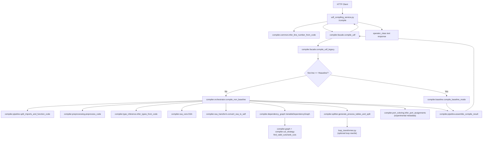
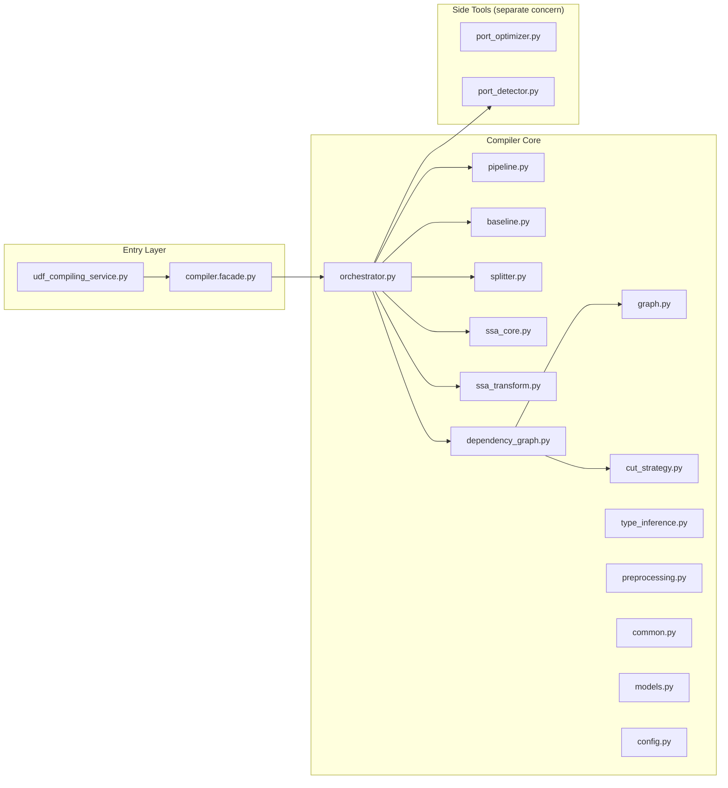

# Python Compiling Service Architecture

## Runtime Call Flow

## Module Layering

## Recommended Use Case

For a concrete compile input and expected output shape, use:

- `core/python_compiling_service/docs/good_use_case.md`
- `core/python_compiling_service/examples/good_use_case.py`
